# android mcp

- [Introduction](#Introduction)
- [Setup](#Setup)
- [Virtualization](#Virtualization)
  - [Usage](#Usage)

## Introduction

This repository is a proof-of-concept to drive an android phone via `adb` using the mcp protocol.

- Analyze UI components
- Take screenshot
- Type text
- Touch and Swipe input
- Launch apps

> Preview: https://cdn.micartey.dev/preview/video/aHR0cHM6Ly9jZG4ubWljYXJ0ZXkuZGV2L2FwaS92MS9zdHJlYW0vYmxvYi9BbmRyb2lkTUNQLm1vdg==

## Setup

The setup is fairly easy given you have already an connected device and created an `adb` session.

```bash
nix develop .#mcp
```

Afterward, you have to configure the mcp server in your tool of choice.
It needs to support **SSE** as the endpoint will be exposed to:

```
http://localhost:3134/sse
```

## Virtualization

In case you want to use a VM instead of an actual android device, you need to start with creating one

1. First we need to create a `qcow2` image for our vm to boot later.
This needs to be done with the following command

```bash
just create-qcow2-image
```

2. For the next step we need the `iso` image from the [android](https://www.android-x86.org/releases/releasenote-9-0-rc1.html).

3. Next, create a new VM and add the `iso` file.
Select the `qcow2` image as your drive.

4. After starting, you need to **install** android.
**DO NOT choose the Live CD**.

<details>
  <summary> The following images are a step-by-step guide on how to install it </summary>

  <div display="flex" flex-wrap="wrap">
    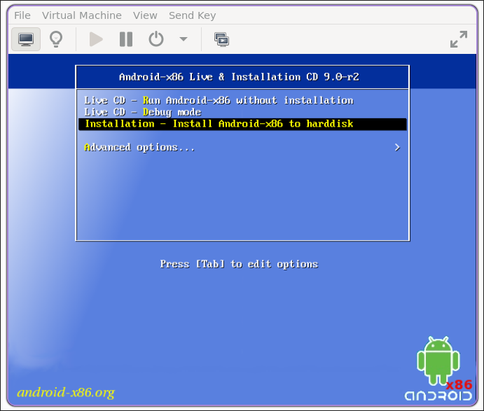
    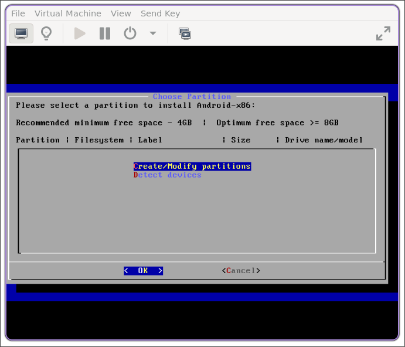
    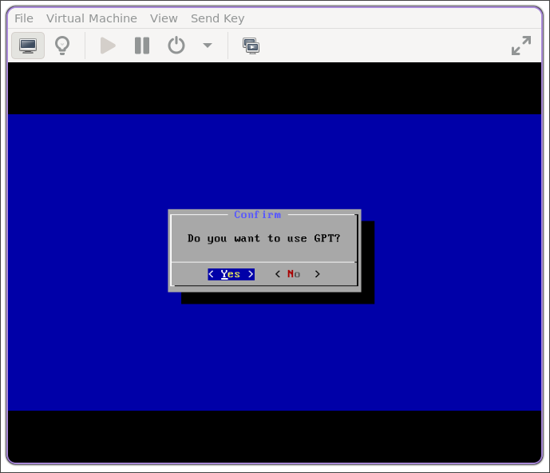
    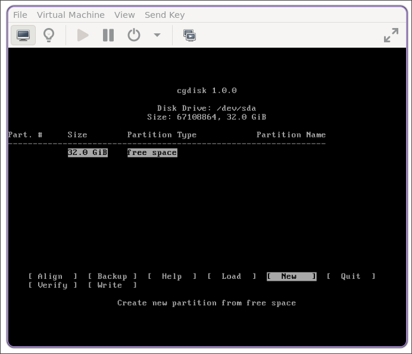
    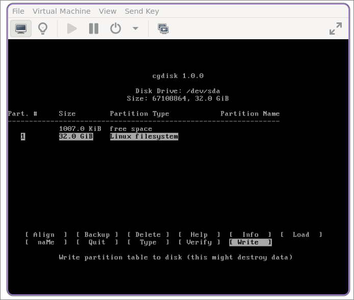
    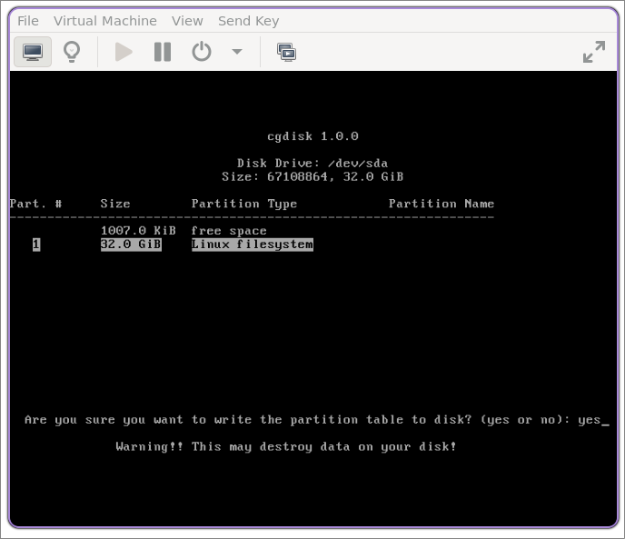
    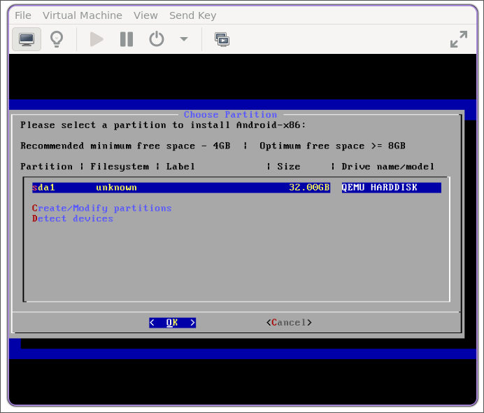
    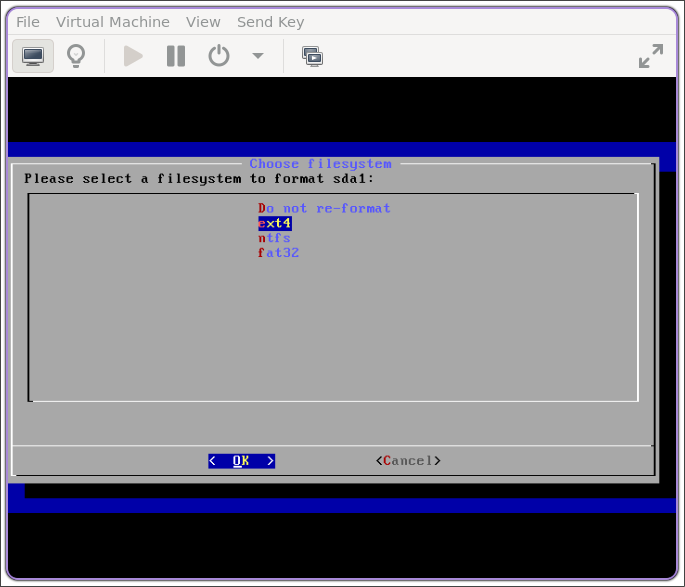
    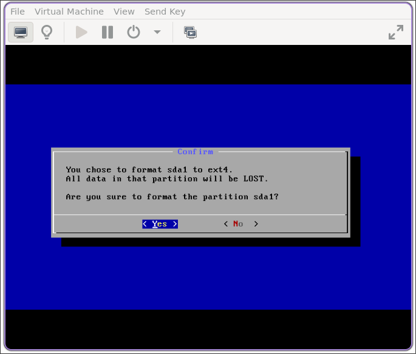
    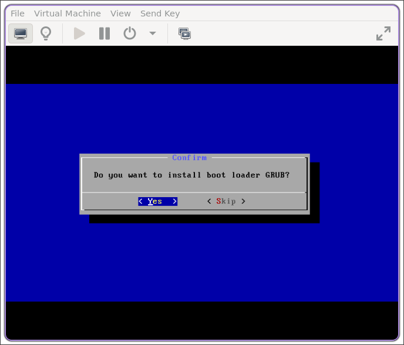
    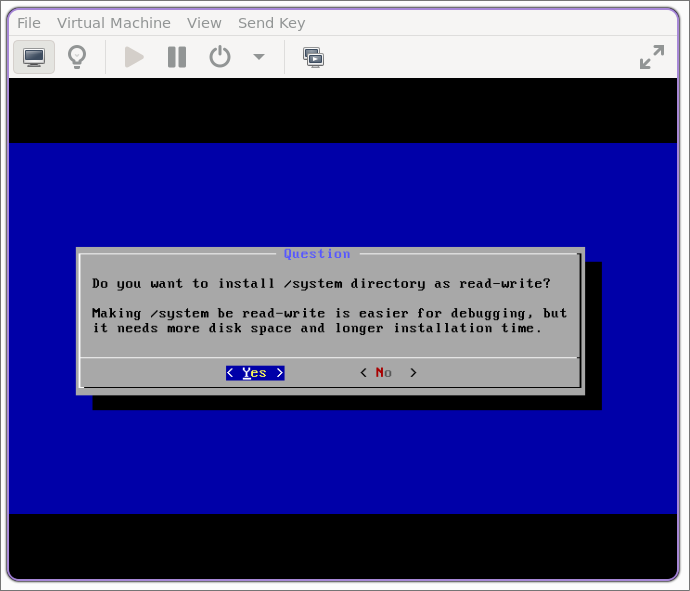
  </div>
</details>

5. Enable Debug Mode so that the device can communicate with adb

Now you can stop the VM.

### Usage

First you want to start the VM

```bash
just vm-silent
```

Then you will need to run a slightly different command as this will also take care of connecting via adb

```bash
nix develop
```
